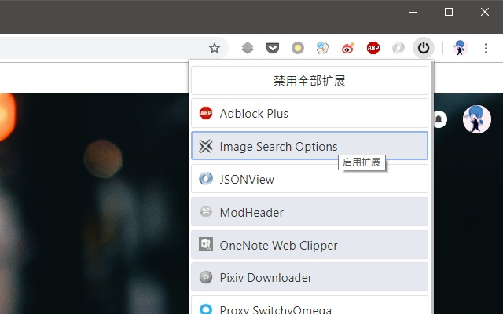
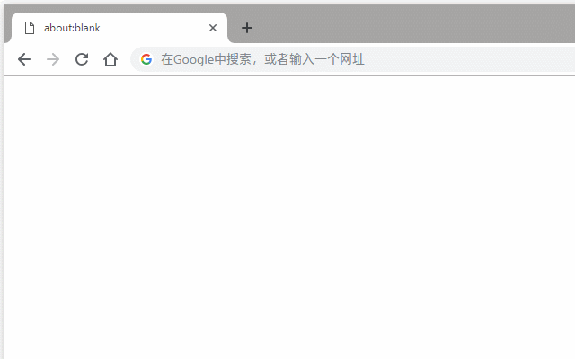

# Extensions-Steward

[更新日志(CHANGELOG)](changelog.md)

## Introduction

扩展管家，快速启用、禁用扩展，禁用全部扩展、恢复被禁用的扩展以及搜索扩展

## Screenshots and Examples

上图是处于打开状态的扩展管家。按下 <kbd>Shift+Alt+Z</kbd> 可以快速打开扩展列表，如果此快捷键被其他程序占用，可以前往 `chrome://extensions/shortcuts` 自定义快捷键。

上图是选项栏。取消勾选通知我更新详情，可以关闭更新时自动打开更新日志的功能。勾选保持上一次搜索的状态，可以在打开扩展列表时保持上一次的搜索状态。

上图是使用 Omnibox（地址栏）方便的搜索 Chrome 商店中的扩展。在地址栏中输入 `ems`，按下 <kbd>Space</kbd> 或 <kbd>Tab</kbd> 键，输入你要搜索的扩展名称，按下 <kbd>Enter</kbd> 键即可快速到达 Chrome 商店的搜索列表中。

上图展示了快捷搜索扩展的功能。输入英文字母/汉字拼音可以快速查找相关的扩展，同时可以使用 `@` 限定符来查找启用/禁用的扩展。按下 <kbd>Tab</kbd> 或 <kbd>Shift+Tab</kbd> 可以切换焦点，按下 <kbd>Enter</kbd> 键可以启用/禁用已获取焦点的扩展。

## FAQ

-   为什么不提供移除其他扩展的功能？
    -   由于缺少设计方案，因此暂时不提供此功能
-   触发 Omnibox（地址栏）事件的关键字是什么意思？
    -   Extensions Management Searcher 首字母的缩写（ems）
-   为什么快捷搜索时不能输入一些特殊字符？
    -   快捷搜索时只能设别指定字符，包括：英文字母(A-Z)、阿拉伯数字(0-9)、限定符(@)、<kbd>Esc</kbd>、<kbd>Backspace</kbd>
-   限定符后面有效的关键字有哪些？
    -   以下时有效的关键字，选取自己熟悉一种的即可
    -   启用：`on`, `enable`, `enabled`, `dk`, `dakai`, `qy`, `qiyong`
    -   禁用：`off`, `disable`, `disabled`, `gb`, `guanbi`, `jy`, `jinyong`

## Privacy Policy

[隐私权和条款](docs/privacy-policy.md)
